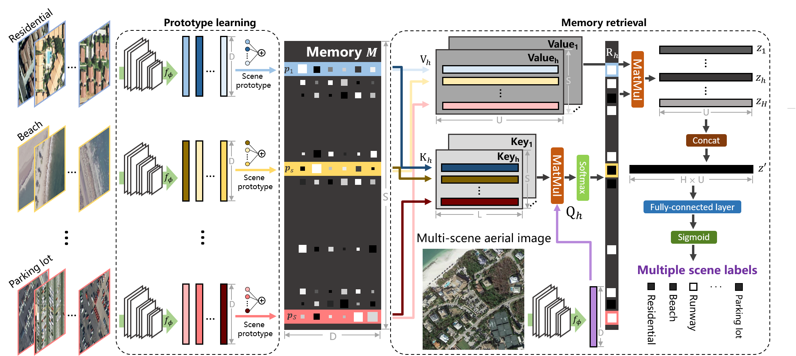

# Prototype-based-Memory-Network
The labels and codes for [Aerial Scene Understanding in The Wild: Multi-Scene Recognition via Prototype-based Memory Networks]()

## Network
The architecture of our prototype-based memory network


## Usage
1) install dependencies in ```requirements.txt```
2) download [MAI_dataset](https://drive.google.com/drive/folders/1xMWXxDeELmGKBdBZopSzk4rTpw7kqwzb?usp=sharing) and unzip ```images.zip```. To learn scene prototypes, [AID](https://captain-whu.github.io/AID/) and [UCM](http://weegee.vision.ucmerced.edu/datasets/landuse.html) datasets are required. The data directory structure should be as follows:
```
  path/to/data/
    MAI_dataset/
      configs/        # data split for UCM2MAI and AID2MAI
      images/         # images     
      label_list.txt  # indices of scene labels
      multilabel.mat  # scene labels
      
    AID_dataset/      # AID dataset
      Airport/
      Beach/
      ...
      
    UCM_dataset/      # UCM dataset
      agricultural/
      airplane/
      ...
```
### Network learning
1) learn scene prototypes on a single-scene aerial image dataset (e.g., UCM)
```python main_cnn.py --data_config='ucm_si' --backbone='resnet50' --weight_path='path/to/cnn.h5' --ep 100 --lr 2e-4 --evaluate 0 ```
2) store prototypes in the memory
``` python memory_gen.py```
3) retrieve memory for unconstrained multi-scene recognition
```python main_pmnet.py --data_config='ucm2mai' --backbone='resnet50' --pretrain_weight_path='path/to/cnn.h5' --weight_path='path/to/pmnet.h5' --ep 100 --lr 5e-4 --evaluate 0 ```

### Inference
evaluating the performance of PM-ResNet50
```python main_pmnet.py --data_config='ucm2mai' --backbone='resnet50' --weight_path='path/to/pm-resnet50.h5' --ep 100 --lr 5e-4 --evaluate 1 ```

## Citation
If you find they are useful, please kindly cite the following:
```
@article{hua2021prototype,
  title={Aerial Scene Understanding in The Wild: Multi-Scene Recognition via Prototype-based Memory Networks},
  author={Hua, Yuansheng and Mou, Lichao and Lin, Jianzhe and Heidler, Konrad and Zhu, Xiao Xiang},
  journal={ISPRS Journal of Photogrammetry and Remote Sensing},
  year={in press}
}
```
